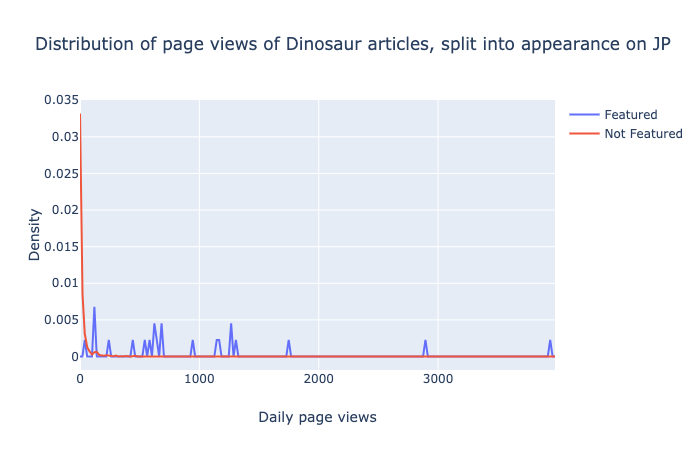
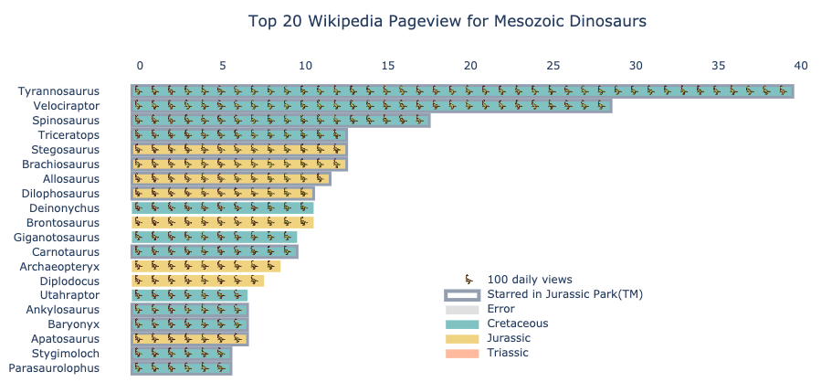

# Wikipedia_dinosaurs
What are the most popular dinosaurs on Wikipedia? Are they all from Jurassic Park? What era are they from?

# Premise
## Pageviews = Popularity
Wikipedia pageviews are taken here as a proxy for popularity, although there are a few caveats to that.

## What is a dinosaur?
Any article that is under a child category of `Category:Mesozoic dinosaurs`. Curiously, there are two categories in `Category:Dinosaurs by geologic time unit`. The other, `Category:Cenozoic dinosaurs`, populated the dataset with woodpeckers etc. So I could not use that. In fact, the third most popular dinosaur is a Moa. So I kept it strictly Mesozoic. There are about 1449 pages.

## Jurassic Park: causality or feedback?

Well, everyone has seen Jurassic Park. So I would have predicted that all the most popular dinosaurs appear in Jurassic Park. And luckily someone who knows their dinos made a table on Wikipedia: [List of cloned animals in the Jurassic Park series](https://en.wikipedia.org/wiki/List_of_cloned_animals_in_the_Jurassic_Park_series).

One thing to stress is causality, the dinosaurs cloned within the Jurassic Park Universe  were iconic before the movie came out, hence why they were chosen. However, due to the movie they may have gotten more famous.

There are no protoceratops in JP and it gets 299 daily views, which is very low. As a kid I had a coffee cup with a protoceratops (no horn triceratops) on it from the Natural History Museum. So I'd say it _was_ a popular dinosaur that lost prestige by not being cast in JP.
As expected the distribution of all dinosaur pages is a power law, while the JP dinos are the top outliers.

## Excluded
Also worth noting, not all species in JP were dinosaurs. The non-dinosaurs were goat (rest in peace),  Pteranodon (a pterosaur), Dimorphodon (a pterosaur), Mosasaurus (the fish-dino-thing in the tank in Jurassic World) and Homo sapiens.

# Top 20

So I went silly with this graph: I really wanted a pictograph.
I found [a really cute and consistent dino icon set in Flaticon](https://www.flaticon.com/packs/dinosaurs-9), but the 3,900 views of the top dinosaur made it an awkward number and I did not want to do 1 unit is 500 page views. So I just stuck with the single dinosaur.

I considered other plots, such as circles with different sizes with the dinosaur in question inside, but that would have required tweaking in illustrator and iOS Catalina update has destroyed my Adobe updater, which is needed to make Photoshop/Illustrator update and work in Catalina...

But let's look at this graph.

# Top 100
See [Top 100 dinosaur table](./top100.md).

# Bottom 3
The most unloved cloned in Jurassic Park are very similar to other dinosaurs, so makes sense they are not as searched.
* [Nasutoceratops](https://en.wikipedia.org/wiki/Nasutoceratops) is a triceratops variant and gets only 42 daily views.
* [Corythosaurus](https://en.wikipedia.org/wiki/Corythosaurus) is a hadrosaur variant (duck-billed one) gets 129 daily views.
* [Mamenchisaurus](https://en.wikipedia.org/wiki/Mamenchisaurus) is a brontosaurus variant that gets 131.
Then it is odd. As in forth-last is [Sinoceratops](https://en.wikipedia.org/wiki/Sinoceratops), the bad-arse–looking single-horned ceratops with holes in its nape-armour and, in fifth-last [Gallimimus](https://en.wikipedia.org/wiki/Gallimimus), which I am pretty sure the annoying kid names in the first movie.

Of all dinosaurs, the data gets messy, _e.g._ Camptodontornis has a new article, while Montanoceratops cerorhynchos is a redirect to the more popular Montanoceratops, but at the lowest place are the birds [Ornithotarnocia](https://en.wikipedia.org/wiki/Ornithotarnocia) [Maaqwi](https://en.wikipedia.org/wiki/Maaqwi), with less than a visitor and a half per day. But these are stubs. Tragically, the curated and long article about family [Dictyoolithidae](https://en.wikipedia.org/wiki/Dictyoolithidae) is also par with them.

# Part of a series
I really like looking at what are the most popular X in Wikipedia based on page views.
They are really interesting and are unbiased unlike a Top 10 X from Buzzfeed list, written by someone based on a sample size of one. It shows oddity that are hard to explain.

For example, in my summary of the [Solar system](https://github.com/matteoferla/Wikipedia_Mars/blob/master/planets.png) the page about Pluto gets nearly as many views as Mars. Although, that is because some [Martian places](https://github.com/matteoferla/Wikipedia_Mars) and allied pages get loads more views.

Often I get to find out about unexpected things. In the case of [stars](https://github.com/matteoferla/Wikipedia_star), there are more people in the Northern hemisphere and bright stars (in relative magnitude) are searched. Closeness to a lesser extent. But the stars invisible to the unaided eye with high daily views were the cool ones at the extremes of the laws of physics. In the case of [planes](https://github.com/matteoferla/Wikipedia_planes), there some expected trends (everyone loves fighter jets), but the low unit vehicles with high views were all new to me and very very weird.

# See also
I have written two blog posts relevant to this repo:
* [Wikipedia template datamining](https://blog.matteoferla.com/2019/07/wikipedia-datamining.html)
* [Plotly pictographs](https://blog.matteoferla.com/2019/10/pictograms-with-plotly-and-fontawesome.html)

